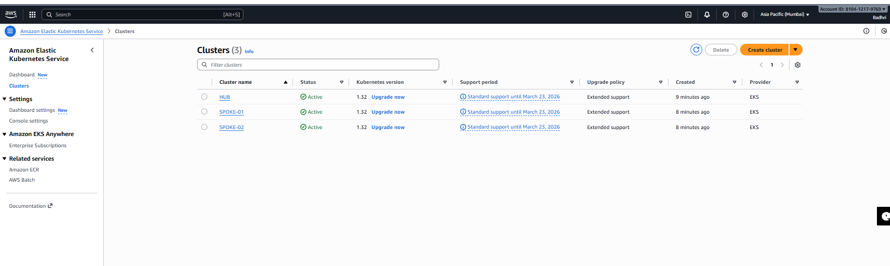

# 🚀 Argo CD Multi-Cluster GitOps Project

[](https://kubernetes.io/)
[](https://argoproj.github.io/cd/)
[](https://aws.amazon.com/)
[](https://www.gitops.tech/)

A production-ready implementation of **GitOps** using **Argo CD** to manage multiple Kubernetes clusters from a centralized control plane. This project demonstrates the **Hub-and-Spoke architecture** pattern for multi-cluster application deployment on AWS EKS.

---

## 📋 Table of Contents

- [Overview](#-overview)
- [Architecture](#-architecture)
- [Key Features](#-key-features)
- [Technology Stack](#-technology-stack)
- [Prerequisites](#-prerequisites)
- [Project Structure](#-project-structure)
- [Installation Guide](#-installation-guide)
- [Configuration](#-configuration)
- [Usage](#-usage)
- [GitOps Workflow](#-gitops-workflow)
- [Troubleshooting](#-troubleshooting)
- [Best Practices](#-best-practices)
- [Cleanup](#-cleanup)
- [Contributing](#-contributing)
- [License](#-license)

---

## 🎯 Overview

This project implements a **multi-cluster Kubernetes management system** using Argo CD with a Hub-and-Spoke topology. It enables:

- **Centralized Management**: Single Argo CD instance managing multiple EKS clusters
- **GitOps Automation**: Git repository as the single source of truth
- **Multi-Environment Deployment**: Deploy applications across dev/staging/prod environments
- **Self-Healing**: Automatic drift detection and remediation
- **Scalability**: Easy addition of new clusters without architectural changes

### What is Hub-and-Spoke Architecture?

```
┌──────────────────────────────────────────────────────────┐
│                     Git Repository                        │
│                  (Source of Truth)                        │
└─────────────────────┬────────────────────────────────────┘
                      │
                      ▼
┌──────────────────────────────────────────────────────────┐
│                    HUB CLUSTER                            │
│              ┌─────────────────────┐                      │
│              │     Argo CD         │                      │
│              │  Control Plane      │                      │
│              │  - API Server       │                      │
│              │  - Repo Server      │                      │
│              │  - App Controller   │                      │
│              │  - Web UI           │                      │
│              └─────────────────────┘                      │
└────────────────┬──────────────────┬──────────────────────┘
                 │                  │
        ┌────────▼────────┐  ┌─────▼──────────┐
        │   SPOKE-01      │  │   SPOKE-02     │
        │  EKS Cluster    │  │  EKS Cluster   │
        │  - App Workloads│  │  - App Workloads│
        │  - Auto-synced  │  │  - Auto-synced  │
        └─────────────────┘  └─────────────────┘
```

---

## 🏗️ Architecture

### High-Level Architecture Diagram

```
┌─────────────────────────────────────────────────────────────────┐
│                                                                 │
│  ┌───────────┐     ┌────────────┐     ┌──────────────┐        │
│  │ Developer │────▶│    Git     │────▶│   Argo CD    │        │
│  │           │     │ Repository │     │  (HUB)       │        │
│  └───────────┘     └────────────┘     └──────┬───────┘        │
│                                               │                 │
│                                    ┌──────────┴──────────┐      │
│                                    │                     │      │
│                             ┌──────▼──────┐      ┌──────▼─────┐│
│                             │  SPOKE-01   │      │  SPOKE-02  ││
│                             │ (Production)│      │  (Staging) ││
│                             └─────────────┘      └────────────┘│
│                                                                 │
└─────────────────────────────────────────────────────────────────┘
```

### Component Breakdown

#### 1. **Git Repository** 📦
- **Role**: Single source of truth for all Kubernetes manifests
- **Contents**: 
  - Deployment configurations
  - Service definitions
  - ConfigMaps and Secrets
  - Application manifests
- **Benefits**: Version control, audit trail, rollback capability

#### 2. **HUB Cluster** (Control Plane) 🎮
- **Components**:
  - **Argo CD API Server**: REST/gRPC API for cluster management
  - **Repository Server**: Clones Git repos and generates manifests
  - **Application Controller**: Monitors applications and syncs desired state
  - **Web UI**: Visual interface for application management
  - **Redis**: Caching layer
  - **Dex**: Identity management (optional)

- **Responsibilities**:
  - Monitor Git repository for changes
  - Store cluster credentials securely
  - Orchestrate deployments to spoke clusters
  - Provide centralized visibility
  - Health checking and status reporting

#### 3. **SPOKE Clusters** (Target Clusters) 🎯
- **SPOKE-01**: Production workloads
- **SPOKE-02**: Staging environment
- **Characteristics**:
  - Independent EKS clusters
  - Run actual application pods
  - Managed remotely by HUB
  - Auto-synced from Git
  - Self-healing enabled

---

## ✨ Key Features

### 1. **GitOps Automation** 🔄
```
Developer Workflow:
1. Developer commits changes to Git
2. Argo CD detects changes automatically
3. Changes validated against desired state
4. Auto-sync to target clusters
5. Health status reported back
```

### 2. **Multi-Cluster Management** 🌐
- Manage unlimited clusters from single control plane
- Independent cluster lifecycle management
- Centralized RBAC and access control
- Cross-cluster application visibility

### 3. **Self-Healing** 🏥
- Automatic drift detection
- Reconciliation of manual changes
- Desired state enforcement
- Rollback on failures

### 4. **Security** 🔒
- Encrypted cluster credentials
- RBAC integration
- SSO support (via Dex)
- Audit logging
- Network policies

### 5. **Observability** 👁️
- Real-time sync status
- Application health monitoring
- Resource utilization tracking
- Event logs and history
- Metrics export (Prometheus)

---

## 🛠️ Technology Stack

| Component | Technology | Version | Purpose |
|-----------|-----------|---------|---------|
| **Container Orchestration** | Kubernetes (EKS) | 1.28+ | Cluster management |
| **GitOps Tool** | Argo CD | 2.9+ | Continuous deployment |
| **Cloud Provider** | AWS | - | Infrastructure hosting |
| **Cluster Creation** | eksctl | 0.165+ | EKS cluster provisioning |
| **CLI Tool** | kubectl | 1.28+ | Kubernetes interaction |
| **Version Control** | Git/GitHub | - | Source code management |
| **Container Runtime** | containerd | - | Container execution |
| **Load Balancer** | AWS ELB | - | Traffic distribution |

---

## 📋 Prerequisites

### Software Requirements

1. **AWS Account**
   - Active AWS account with billing enabled
   - IAM user with administrative permissions
   - [Sign up here](https://aws.amazon.com/resources/create-account/)

2. **AWS CLI** (v2.x)
   ```bash
   # Installation
   curl "https://awscli.amazonaws.com/awscli-exe-linux-x86_64.zip" -o "awscliv2.zip"
   unzip awscliv2.zip
   sudo ./aws/install
   
   # Verify
   aws --version
   
   # Configure
   aws configure
   # Enter: AWS Access Key ID, Secret Access Key, Region, Output format
   ```

3. **kubectl** (v1.28+)
   ```bash
   # Linux installation
   curl -LO "https://dl.k8s.io/release/$(curl -L -s https://dl.k8s.io/release/stable.txt)/bin/linux/amd64/kubectl"
   chmod +x kubectl
   sudo mv kubectl /usr/local/bin/
   
   # Verify
   kubectl version --client
   ```

4. **eksctl** (v0.165+)
   ```bash
   # Linux installation
   curl --silent --location "https://github.com/weaveworks/eksctl/releases/latest/download/eksctl_$(uname -s)_amd64.tar.gz" | tar xz -C /tmp
   sudo mv /tmp/eksctl /usr/local/bin
   
   # Verify
   eksctl version
   ```

5. **Argo CD CLI** (v2.9+)
   ```bash
   # Linux installation
   curl -sSL -o argocd-linux-amd64 https://github.com/argoproj/argo-cd/releases/latest/download/argocd-linux-amd64
   sudo install -m 555 argocd-linux-amd64 /usr/local/bin/argocd
   
   # Verify
   argocd version --client
   ```

### AWS Permissions Required

Create an IAM policy with these permissions:
```json
{
  "Version": "2012-10-17",
  "Statement": [
    {
      "Effect": "Allow",
      "Action": [
        "eks:*",
        "ec2:*",
        "autoscaling:*",
        "cloudformation:*",
        "iam:CreateRole",
        "iam:AttachRolePolicy",
        "iam:PutRolePolicy"
      ],
      "Resource": "*"
    }
  ]
}
```

### SSH Key Pair

Generate SSH key for EKS nodes:
```bash
ssh-keygen -t rsa -b 4096 -f ~/.ssh/eks-nodes -C "eks-nodes-key"
# This creates: eks-nodes (private) and eks-nodes.pub (public)
```

---

## 📁 Project Structure

```
Argo-CD-Project/
│
├── manifests/                          # Kubernetes manifests
│   ├── deployment.yaml                 # Application deployment
│   ├── service.yaml                    # LoadBalancer service
│   └── configmap.yaml                  # Configuration (optional)
│
├── argocd-apps/                        # Argo CD Application definitions
│   ├── spoke-01-app.yaml              # SPOKE-01 application
│   └── spoke-02-app.yaml              # SPOKE-02 application
│
├── docs/                               # Documentation
│   ├── architecture.md                 # Architecture details
│   ├── troubleshooting.md             # Common issues
│   └── screenshots/                    # UI screenshots
│
├── scripts/                            # Automation scripts
│   ├── setup-hub.sh                   # HUB cluster setup
│   ├── setup-spokes.sh                # SPOKE clusters setup
│   └── cleanup.sh                     # Resource cleanup
│
└── README.md                          # This file
```

---

## 🚀 Installation Guide

### Phase 1: Create EKS Clusters

#### Step 1.1: Create HUB Cluster

```bash
eksctl create cluster \
  --name HUB \
  --region ap-south-1 \
  --zones ap-south-1a,ap-south-1b \
  --nodegroup-name hub-ng-public \
  --node-type m7i-flex.large \
  --nodes 2 \
  --nodes-min 2 \
  --nodes-max 4 \
  --node-volume-size 20 \
  --ssh-access \
  --ssh-public-key eks-nodes \
  --managed \
  --asg-access \
  --external-dns-access \
  --full-ecr-access \
  --appmesh-access \
  --alb-ingress-access
```

**Estimated time**: 15-20 minutes

**What happens**:
- Creates VPC with public/private subnets
- Provisions EKS control plane
- Launches 2 managed worker nodes
- Configures security groups
- Sets up IAM roles and policies

#### Step 1.2: Create SPOKE-01 Cluster

```bash
eksctl create cluster \
  --name SPOKE-01 \
  --region ap-south-1 \
  --zones ap-south-1a,ap-south-1b \
  --nodegroup-name spoke01-ng-public \
  --node-type m7i-flex.large \
  --nodes 2 \
  --nodes-min 2 \
  --nodes-max 4 \
  --node-volume-size 20 \
  --ssh-access \
  --ssh-public-key eks-nodes \
  --managed
```

#### Step 1.3: Create SPOKE-02 Cluster

```bash
eksctl create cluster \
  --name SPOKE-02 \
  --region ap-south-1 \
  --zones ap-south-1a,ap-south-1b \
  --nodegroup-name spoke02-ng-public \
  --node-type m7i-flex.large \
  --nodes 2 \
  --nodes-min 2 \
  --nodes-max 4 \
  --node-volume-size 20 \
  --ssh-access \
  --ssh-public-key eks-nodes \
  --managed
```

#### Step 1.4: Verify Cluster Creation

```bash
# List all clusters
eksctl get cluster --region ap-south-1

# Check kubectl contexts
kubectl config get-contexts

# You should see three contexts:
# - <user>@HUB.ap-south-1.eksctl.io
# - <user>@SPOKE-01.ap-south-1.eksctl.io
# - <user>@SPOKE-02.ap-south-1.eksctl.io
```

---

### Phase 2: Install Argo CD on HUB

#### Step 2.1: Switch to HUB Context

```bash
kubectl config use-context <user>@HUB.ap-south-1.eksctl.io

# Verify
kubectl config current-context
```

#### Step 2.2: Create Argo CD Namespace

```bash
kubectl create namespace argocd
```

#### Step 2.3: Install Argo CD

```bash
kubectl apply -n argocd -f https://raw.githubusercontent.com/argoproj/argo-cd/stable/manifests/install.yaml
```

#### Step 2.4: Wait for Pods to be Ready

```bash
# Watch pods until all are Running
kubectl get pods -n argocd -w

# Expected pods:
# - argocd-application-controller
# - argocd-applicationset-controller
# - argocd-dex-server
# - argocd-notifications-controller
# - argocd-redis
# - argocd-repo-server
# - argocd-server
```

This may take 3-5 minutes.

---

### Phase 3: Expose Argo CD UI

#### Step 3.1: Enable Insecure Mode

```bash
kubectl edit cm argocd-cmd-params-cm -n argocd
```

Add this under `data:` section:
```yaml
data:
  server.insecure: "true"
```

Save and exit (`:wq` in vim).

#### Step 3.2: Change Service to NodePort

```bash
kubectl edit svc argocd-server -n argocd
```

Change:
```yaml
spec:
  type: ClusterIP
```

To:
```yaml
spec:
  type: NodePort
```

Save and exit.

#### Step 3.3: Get NodePort and External IP

```bash
# Get NodePort
kubectl get svc argocd-server -n argocd
# Note the NodePort (e.g., 30080)

# Get Node External IP
kubectl get nodes -o wide
# Note the EXTERNAL-IP of any node
```

#### Step 3.4: Update Security Group

1. Go to AWS Console → EC2 → Security Groups
2. Find the security group for HUB cluster nodes
3. Add inbound rule:
   - **Type**: Custom TCP
   - **Port**: NodePort from above (e.g., 30080)
   - **Source**: Your IP or 0.0.0.0/0 (for testing only)

#### Step 3.5: Retrieve Admin Password

```bash
# Get the secret
kubectl get secret argocd-initial-admin-secret -n argocd -o yaml

# Decode the password
echo "<base64-password>" | base64 --decode
```

#### Step 3.6: Access Argo CD UI

Open browser and navigate to:
```
http://<NODE-EXTERNAL-IP>:<NODEPORT>
```

Login with:
- **Username**: `admin`
- **Password**: (decoded password from above)

---

### Phase 4: Configure Argo CD CLI

#### Step 4.1: Login via CLI

```bash
argocd login <NODE-EXTERNAL-IP>:<NODEPORT>
# Username: admin
# Password: <decoded-password>

# Accept insecure connection warning (y)
```

#### Step 4.2: Change Admin Password (Recommended)

```bash
argocd account update-password
```

#### Step 4.3: Verify Login

```bash
argocd cluster list
# Should show: https://kubernetes.default.svc (in-cluster)
```

---

### Phase 5: Register SPOKE Clusters

#### Step 5.1: Add SPOKE-01

```bash
argocd cluster add <user>@SPOKE-01.ap-south-1.eksctl.io \
  --server <ARGOCD-IP>:<PORT> \
  --name spoke-01
```

**What happens**:
1. Creates `argocd-manager` ServiceAccount in SPOKE-01
2. Creates ClusterRole with admin permissions
3. Creates ClusterRoleBinding
4. Generates bearer token
5. Stores credentials in HUB's Argo CD

#### Step 5.2: Add SPOKE-02

```bash
argocd cluster add <user>@SPOKE-02.ap-south-1.eksctl.io \
  --server <ARGOCD-IP>:<PORT> \
  --name spoke-02
```

#### Step 5.3: Verify Clusters

```bash
# CLI
argocd cluster list

# Expected output:
# SERVER                                  NAME       VERSION  STATUS      MESSAGE
# https://kubernetes.default.svc          in-cluster          Successful
# https://<SPOKE-01-API>.amazonaws.com    spoke-01            Successful
# https://<SPOKE-02-API>.amazonaws.com    spoke-02            Successful
```

Also verify in UI:
- Settings → Clusters → Should show 3 clusters

---

## ⚙️ Configuration

### Deploying Applications

#### Method 1: Using Argo CD UI

1. **Click "New App"**
2. **General Settings**:
   - Application Name: `nginx-spoke-01`
   - Project: `default`
   - Sync Policy: `Automatic`
   - Sync Options:
     - ✅ Prune Resources
     - ✅ Self Heal

3. **Source**:
   - Repository URL: `https://github.com/<your-repo>/Argo-CD-Project.git`
   - Revision: `main`
   - Path: `manifests`

4. **Destination**:
   - Cluster URL: Select `spoke-01`
   - Namespace: `default`

5. **Click "Create"**

#### Method 2: Using CLI

```bash
argocd app create nginx-spoke-01 \
  --repo https://github.com/<your-repo>/Argo-CD-Project.git \
  --path manifests \
  --dest-server https://<SPOKE-01-API>.amazonaws.com \
  --dest-namespace default \
  --sync-policy automated \
  --auto-prune \
  --self-heal
```

#### Method 3: Using Declarative YAML

Create `argocd-apps/nginx-spoke-01.yaml`:

```yaml
apiVersion: argoproj.io/v1alpha1
kind: Application
metadata:
  name: nginx-spoke-01
  namespace: argocd
spec:
  project: default
  
  source:
    repoURL: https://github.com/<your-repo>/Argo-CD-Project.git
    targetRevision: main
    path: manifests
  
  destination:
    server: https://<SPOKE-01-API>.amazonaws.com
    namespace: default
  
  syncPolicy:
    automated:
      prune: true
      selfHeal: true
    syncOptions:
    - CreateNamespace=true
```

Apply:
```bash
kubectl apply -f argocd-apps/nginx-spoke-01.yaml -n argocd
```

---

## 🔄 Usage

### Sync Applications

```bash
# Manual sync
argocd app sync nginx-spoke-01

# Sync all applications
argocd app sync --all

# Watch sync progress
argocd app wait nginx-spoke-01 --health
```

### View Application Status

```bash
# CLI
argocd app get nginx-spoke-01

# Tree view
argocd app get nginx-spoke-01 --show-operation

# Logs
argocd app logs nginx-spoke-01
```

### Access Deployed Application

```bash
# Switch to SPOKE-01 context
kubectl config use-context <user>@SPOKE-01.ap-south-1.eksctl.io

# Get LoadBalancer URL
kubectl get svc -n default

# Example output:
# NAME    TYPE           EXTERNAL-IP                      PORT(S)
# nginx   LoadBalancer   a1b2c3d4.ap-south-1.elb.amazonaws.com   80:30123/TCP

# Test
curl http://<EXTERNAL-IP>
```

### Update Application

1. **Edit manifest in Git**:
```yaml
# manifests/deployment.yaml
spec:
  replicas: 5  # Changed from 3
```

2. **Commit and push**:
```bash
git add manifests/deployment.yaml
git commit -m "Scale to 5 replicas"
git push origin main
```

3. **Argo CD auto-syncs** (if auto-sync enabled)
4. **Verify in UI or CLI**:
```bash
argocd app get nginx-spoke-01
kubectl get pods -n default  # Should show 5 pods
```

---

## 🔁 GitOps Workflow

### Complete Workflow Diagram

```
Developer          Git Repo          Argo CD          Kubernetes
    │                 │                  │                 │
    │  1. Commit      │                  │                 │
    │ ──────────────> │                  │                 │
    │                 │                  │                 │
    │                 │  2. Poll/Webhook │                 │
    │                 │ <──────────────> │                 │
    │                 │                  │                 │
    │                 │  3. Detect Diff  │                 │
    │                 │ ──────────────>  │                 │
    │                 │                  │                 │
    │                 │                  │  4. Apply       │
    │                 │                  │ ──────────────> │
    │                 │                  │                 │
    │                 │                  │  5. Report      │
    │                 │                  │ <────────────── │
    │                 │                  │                 │
    │  6. Notify      │                  │                 │
    │ <───────────────────────────────── │                 │
```

### Workflow Steps Explained

1. **Developer Commits**: Push changes to Git repository
2. **Detection**: Argo CD polls repo every 3 minutes (default) or receives webhook
3. **Comparison**: Compares desired state (Git) vs actual state (cluster)
4. **Sync**: Applies differences to target cluster
5. **Health Check**: Monitors resource health status
6. **Notification**: Reports status back to user/system

### Auto-Sync Behavior

**When enabled**:
- ✅ Automatically applies Git changes
- ✅ Prunes deleted resources
- ✅ Self-heals manual changes
- ✅ Retries on transient failures

**When disabled**:
- 🔵 Shows "OutOfSync" status
- 🔵 Requires manual sync trigger
- 🔵 Useful for approval workflows

---

## 🐛 Troubleshooting

### Common Issues and Solutions

#### Issue 1: Pods Not Starting

```bash
# Check pod status
kubectl get pods -n argocd

# Describe pod
kubectl describe pod <pod-name> -n argocd

# Check logs
kubectl logs <pod-name> -n argocd

# Common fixes:
# - Insufficient resources: Add more nodes
# - Image pull errors: Check ECR permissions
# - Network issues: Verify security groups
```

#### Issue 2: Can't Access Argo CD UI

```bash
# Verify service
kubectl get svc argocd-server -n argocd

# Check security group
aws ec2 describe-security-groups --group-ids <sg-id>

# Verify NodePort is open:
# - Check AWS Console → EC2 → Security Groups
# - Ensure inbound rule exists for NodePort

# Test connectivity
telnet <NODE-IP> <NODEPORT>
```

#### Issue 3: Cluster Registration Failed

```bash
# Check cluster connectivity
kubectl --context=<spoke-context> get nodes

# Re-add cluster with verbose logging
argocd cluster add <context> --name <name> --loglevel debug

# Verify service account
kubectl get sa argocd-manager -n kube-system --context=<spoke-context>

# Check ClusterRoleBinding
kubectl get clusterrolebinding argocd-manager-rolebinding --context=<spoke-context>
```

#### Issue 4: Application OutOfSync

```bash
# View differences
argocd app diff <app-name>

# Force sync
argocd app sync <app-name> --force

# Check sync status
argocd app get <app-name> --show-operation

# View sync logs
argocd app logs <app-name> --follow
```

#### Issue 5: Self-Heal Not Working

```bash
# Verify sync policy
argocd app get <app-name> -o yaml | grep syncPolicy -A 5

# Should show:
#   syncPolicy:
#     automated:
#       prune: true
#       selfHeal: true

# If missing, update:
argocd app set <app-name> --sync-policy automated --auto-prune --self-heal
```

---

## 📚 Best Practices

### 1. Repository Structure

```
✅ Good:
my-app/
├── base/                    # Common resources
│   ├── deployment.yaml
│   └── service.yaml
├── overlays/               # Environment-specific
│   ├── dev/
│   ├── staging/
│   └── production/
└── argocd-apps/            # Application definitions

❌ Avoid:
my-app/
├── everything-in-one-file.yaml
└── no-organization/
```

### 2. Security

```bash
# Use RBAC
# Limit cluster admin access
# Rotate credentials regularly
# Use SSO (Dex/OIDC)
# Enable audit logging

# Example: Create read-only user
kubectl create sa readonly-user -n argocd
argocd account create readonly-user --role readonly
```

### 3. Sync Policies

```yaml
# Production apps: Manual sync with approval
syncPolicy:
  automated: false

# Non-production: Auto-sync with self-heal
syncPolicy:
  automated:
    prune: true
    selfHeal: true
  syncOptions:
  - CreateNamespace=true
  retry:
    limit: 5
    backoff:
      duration: 5s
      factor: 2
      maxDuration: 3m
```

### 4. Health Checks

```yaml
# Define custom health checks
apiVersion: v1
kind: ConfigMap
metadata:
  name: argocd-cm
  namespace: argocd
data:
  resource.customizations: |
    networking.k8s.io/Ingress:
      health.lua: |
        hs = {}
        hs.status = "Healthy"
        return hs
```

### 5. Notifications

Configure notifications for:
- Sync failures
- Health degradation
- Manual sync required
- Successful deployments

```yaml
# Install notifications
kubectl apply -n argocd -f \
  https://raw.githubusercontent.com/argoproj-labs/argocd-notifications/stable/manifests/install.yaml

# Configure Slack webhook
apiVersion: v1
kind: ConfigMap
metadata:
  name: argocd-notifications-cm
data:
  service.slack: |
    token: $slack-token
  template.app-deployed: |
    message: Application {{.app.metadata.name}} deployed successfully
```

### 6. Monitoring

```bash
# Expose metrics
kubectl port-forward svc/argocd-metrics -n argocd 8082:8082

# Prometheus scrape config
- job_name: 'argocd'
  static_configs:
  - targets: ['argocd-metrics.argocd:8082']
```

---

## 🧹 Cleanup

### Delete Applications

```bash
# Delete specific app
argocd app delete nginx-spoke-01 --cascade

# Delete all apps
argocd app list -o name | xargs -n1 argocd app delete --cascade
```

### Remove Clusters from Argo CD

```bash
argocd cluster rm spoke-01
argocd cluster rm spoke-02
```

### Delete EKS Clusters

```bash
# Delete SPOKE clusters first
eksctl delete cluster --name SPOKE-01 --region ap-south-1
eksctl delete cluster --name SPOKE-02 --region ap-south-1

# Delete HUB cluster last
eksctl delete cluster --name HUB --region ap-south-1
```

**Note**: Each deletion takes 10-15 minutes.

### Verify Cleanup

```bash
# Check clusters
eksctl get cluster --region ap-south-1

# Check CloudFormation stacks
aws cloudformation list-stacks --region ap-south-1 \
  --stack-status-filter DELETE_IN_PROGRESS DELETE_COMPLETE

# Verify no resources remain
# - EC2 instances
# - VPCs
# - Load balancers
# - Security groups
```

---

## 🤝 Contributing

Contributions are welcome! Please follow these steps:

1. Fork the repository
2. Create a feature branch (`git checkout -b feature/AmazingFeature`)
3. Commit your changes (`git commit -m 'Add some AmazingFeature'`)
4. Push to the branch (`git push origin feature/AmazingFeature`)
5. Open a Pull Request

### Contribution Guidelines

- Follow Kubernetes manifest best practices
- Add comments to complex configurations
- Update documentation for new features
- Test on your own EKS clusters before submitting
- Follow conventional commit messages

---

## 📊 Project Metrics

| Metric | Value |
|--------|-------|
| **Clusters Managed** | 3 (1 HUB + 2 SPOKE) |
| **Deployment Time** | ~45 minutes (complete setup) |
| **Sync Frequency** | 3 minutes (default polling) |
| **Auto-healing** | Enabled |
| **Cost** | ~$0.20/hour per cluster (approx.) |

---

## 🎓 Learning Resources

### Official Documentation
- [Argo CD Documentation](https://argo-cd.readthedocs.io/)
- [Kubernetes Documentation](https://kubernetes.io/docs/)
- [AWS EKS Guide](https://docs.aws.amazon.com/eks/)
- [GitOps Principles](https://www.gitops.tech/)

### Tutorials
- [Argo CD Getting Started](https://argo-cd.readthedocs.io/en/stable/getting_started/)
- [GitOps with Argo CD](https://www.youtube.com/watch?v=MeU5_k9ssrs)
- [Multi-Cluster Management](https://argo-cd.readthedocs.io/en/stable/operator-manual/declarative-setup/#clusters)

### Community
- [Argo CD Slack](https://argoproj.github.io/community/join-slack)
- [CNCF Slack #argo-cd](https://cloud-native.slack.com/)
- [GitHub Discussions](https://github.com/argoproj/argo-cd/discussions)

---

## 🔮 Future Enhancements

### Planned Features
- [ ] Implement ApplicationSets for multi-cluster deployments
- [ ] Add Argo Rollouts for progressive delivery
- [ ] Integrate Argo Workflows for CI pipeline
- [ ] Set up monitoring with Prometheus + Grafana
- [ ] Configure SSO with Dex/OAuth
- [ ] Implement resource hooks for advanced deployments
- [ ] Add disaster recovery procedures
- [ ] Create Terraform modules for infrastructure

### Want to Contribute?
Pick any item from the list above and submit a PR!

---

## 📝 Changelog

### Version 1.0.0 (Current)
- Initial release
- Hub-and-Spoke architecture
- 3 EKS clusters (1 HUB + 2 SPOKE)
- Auto-sync and self-healing
- LoadBalancer services
- Basic nginx deployment

---

## 💡 Use Cases

This architecture is perfect for:

### 1. **Multi-Environment Management**
- Development, Staging, Production isolation
- Consistent deployment across environments
- Environment-specific configurations

### 2. **Multi-Region Deployments**
- Deploy to multiple AWS regions
- Disaster recovery setup
- Geographic distribution

### 3. **Multi-Tenant Platforms**
- Separate clusters per customer
- Centralized management
- Isolated workloads

### 4. **Edge Computing**
- Central control plane
- Multiple edge locations
- Consistent configuration

### 5. **Hybrid Cloud**
- Manage on-premise + cloud clusters
- Unified deployment pipeline
- Single source of truth

---

## 🏆 Success Criteria

After completing this project, you should be able to:

✅ Create and manage multiple EKS clusters  
✅ Install and configure Argo CD  
✅ Implement GitOps workflow  
✅ Deploy applications across multiple clusters  
✅ Configure auto-sync and self-healing  
✅ Troubleshoot common issues  
✅ Implement security best practices  
✅ Monitor application health  
✅ Scale workloads  
✅ Perform rollbacks  

---

## 🔐 Security Considerations

### Cluster Security
```bash
# Enable cluster encryption
eksctl create cluster --encryption-config encryption-config.yaml

# Use private endpoints
--vpc-private-subnets

# Enable logging
--enable-ssm
--cloudwatch-cluster-logging='*'
```

### Argo CD Security
```yaml
# Use RBAC policies
apiVersion: v1
kind: ConfigMap
metadata:
  name: argocd-rbac-cm
  namespace: argocd
data:
  policy.csv: |
    p, role:readonly, applications, get, */*, allow
    p, role:readonly, clusters, get, *, allow
    g, readonly-user, role:readonly

# Configure SSO
apiVersion: v1
kind: ConfigMap
metadata:
  name: argocd-cm
data:
  dex.config: |
    connectors:
    - type: github
      id: github
      name: GitHub
      config:
        clientID: $github-client-id
        clientSecret: $github-client-secret
```

### Secret Management
- Use AWS Secrets Manager
- Implement sealed secrets
- Enable encryption at rest
- Rotate credentials regularly

---

## 📊 Cost Optimization

### Current Cost Breakdown (Approximate)
| Resource | Cost/Hour | Cost/Month |
|----------|-----------|------------|
| **HUB Cluster** | $0.20 | $144 |
| **SPOKE-01** | $0.20 | $144 |
| **SPOKE-02** | $0.20 | $144 |
| **ELB (per cluster)** | $0.025 | $18 |
| **Total** | ~$0.68 | ~$486 |

### Cost Saving Tips
1. Use Spot Instances for non-production
2. Right-size node instances
3. Implement cluster autoscaling
4. Delete unused clusters
5. Use Savings Plans
6. Enable cost allocation tags

```bash
# Example: Using spot instances
eksctl create cluster \
  --spot \
  --instance-types=m7i-flex.large,m6i.large
```

---

## 🎯 Real-World Scenarios

### Scenario 1: Rolling Update
```bash
# Update image tag in Git
# manifests/deployment.yaml
image: nginx:1.21.0  →  nginx:1.21.1

# Argo CD automatically:
# 1. Detects change
# 2. Applies update
# 3. Performs rolling update
# 4. Monitors health
# 5. Reports status
```

### Scenario 2: Rollback
```bash
# View history
argocd app history nginx-spoke-01

# Rollback to previous version
argocd app rollback nginx-spoke-01 <revision-id>

# Or use Git
git revert <commit-hash>
git push origin main
```

### Scenario 3: Blue-Green Deployment
```yaml
# Create blue-green setup
apiVersion: argoproj.io/v1alpha1
kind: Application
metadata:
  name: nginx-blue
spec:
  destination:
    namespace: blue

---
apiVersion: argoproj.io/v1alpha1
kind: Application
metadata:
  name: nginx-green
spec:
  destination:
    namespace: green
```

---

## 📞 Support

### Getting Help
- **Issues**: [GitHub Issues](https://github.com/bhupal2027/Argo-CD-Project/issues)
- **Discussions**: [GitHub Discussions](https://github.com/bhupal2027/Argo-CD-Project/discussions)
- **Email**: [Contact form](mailto:your-email@example.com)

### Reporting Bugs
When reporting bugs, include:
1. Argo CD version (`argocd version`)
2. Kubernetes version (`kubectl version`)
3. EKS version (`eksctl version`)
4. Error logs (`kubectl logs`)
5. Steps to reproduce

---

## 🌟 Acknowledgments

- **Argo CD Team** - For the amazing GitOps tool
- **AWS** - For EKS platform
- **CNCF** - For Kubernetes
- **Community Contributors** - For inspiration and support

---

## 📄 License

This project is licensed under the MIT License - see the [LICENSE](LICENSE) file for details.

```
MIT License

Copyright (c) 2024 Bhupal

Permission is hereby granted, free of charge, to any person obtaining a copy
of this software and associated documentation files (the "Software"), to deal
in the Software without restriction...
```

---

## ⭐ Star History

If you find this project helpful, please consider giving it a star! ⭐

[](https://star-history.com/#bhupal2027/Argo-CD-Project&Date)

---

## 📸 Screenshots

### Argo CD Dashboard


### Application Sync Status


### Multi-Cluster View


### Application Flow


---

## 🚀 Quick Start (TL;DR)

```bash
# 1. Create clusters
eksctl create cluster --name HUB --region ap-south-1 ...
eksctl create cluster --name SPOKE-01 --region ap-south-1 ...
eksctl create cluster --name SPOKE-02 --region ap-south-1 ...

# 2. Install Argo CD on HUB
kubectl create namespace argocd
kubectl apply -n argocd -f https://raw.githubusercontent.com/argoproj/argo-cd/stable/manifests/install.yaml

# 3. Expose UI (NodePort) and get password
kubectl edit svc argocd-server -n argocd  # Change to NodePort
kubectl get secret argocd-initial-admin-secret -n argocd -o jsonpath="{.data.password}" | base64 -d

# 4. Add SPOKE clusters
argocd cluster add <context-spoke-01>
argocd cluster add <context-spoke-02>

# 5. Deploy application
argocd app create nginx-spoke-01 \
  --repo https://github.com/bhupal2027/Argo-CD-Project.git \
  --path manifests \
  --dest-server <spoke-01-server> \
  --dest-namespace default \
  --sync-policy automated
```

---

## 📚 Additional Resources

### Configuration Files

**manifests/deployment.yaml**
```yaml
apiVersion: apps/v1
kind: Deployment
metadata:
  name: nginx-deployment
  labels:
    app: nginx
spec:
  replicas: 3
  selector:
    matchLabels:
      app: nginx
  template:
    metadata:
      labels:
        app: nginx
    spec:
      containers:
      - name: nginx
        image: nginx:1.21.0
        ports:
        - containerPort: 80
        resources:
          requests:
            memory: "64Mi"
            cpu: "250m"
          limits:
            memory: "128Mi"
            cpu: "500m"
```

**manifests/service.yaml**
```yaml
apiVersion: v1
kind: Service
metadata:
  name: nginx-service
  labels:
    app: nginx
spec:
  type: LoadBalancer
  selector:
    app: nginx
  ports:
  - protocol: TCP
    port: 80
    targetPort: 80
```

---

## 🎉 Conclusion

This project demonstrates a production-ready GitOps implementation using Argo CD on AWS EKS. By following this guide, you've learned how to:

- Set up multi-cluster Kubernetes environments
- Implement GitOps workflows
- Automate application deployments
- Manage infrastructure as code
- Implement self-healing systems

**Next Steps**:
1. Customize for your use case
2. Add monitoring and alerting
3. Implement CI/CD pipelines
4. Scale to more clusters
5. Add advanced Argo CD features

Happy GitOps! 🚀

---

**Made with ❤️ by [Bhupal](https://github.com/bhupal2027)**

**Last Updated**: December 2024

**Project Status**: ✅ Active Development